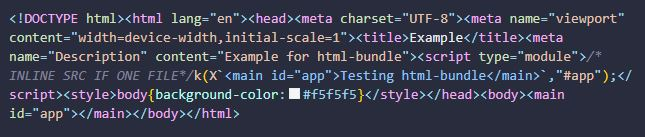

# html-bundle

> A very simple zero-config bundler for HTML files. The idea is to use HTML as Single File Components, because HTML can already include `<style>` and `<script>` Elements. Additionally, `TypeScript` can be used as inline or referenced script in HTML.

## Installation and Usage

```properties
$ npm install -D html-bundle
```

Add an entry to script in package.json

```json
{
  "scripts": {
    "build": "html-bundle" // see flags below
  }
}
```

Add a `postcss.config.cjs` file and run the build command.
<em>If you do not create this config file, a minimal in-memory config file will be created with `cssnano` as plugin.</em>

```properties
$ npm run build
```

## CLI

`--critical`: uses [critical](https://www.npmjs.com/package/critical) to extract and inline critical-path CSS to HTML. <br>

You could also specify a watch command (chokidar-cli) in combination with the Live Server VS Code Plugin:

```json
{
  "chokidar": "html-bundle && chokidar \"src/**/*\" -c \"html-bundle\""
}
```

## Concept

The bundler always globs all HTML, CSS and TS/JS files from the `src/` directory and processes them to the `build/` directory. PostCSS is being used for CSS files and inline styles, html-minifier for HTML and esbuild to bundle, minify, etc. for inline and referenced TS/JS.

## Example

### Input

```html
<!DOCTYPE html>
<html lang="en">
  <head>
    <meta charset="UTF-8" />
    <meta name="viewport" content="width=device-width, initial-scale=1.0" />
    <title>Example</title>
    <meta name="Description" content="Example for html-bundle" />
    <script type="module">
      import { render, html } from "hydro-js";
      render(html`<main id="app">Testing html-bundle</main>`, "#app");
    </script>
    <style>
      body {
        background-color: whitesmoke;
      }
    </style>
  </head>
  <body>
    <main id="app"></main>
  </body>
</html>
```

### Output


