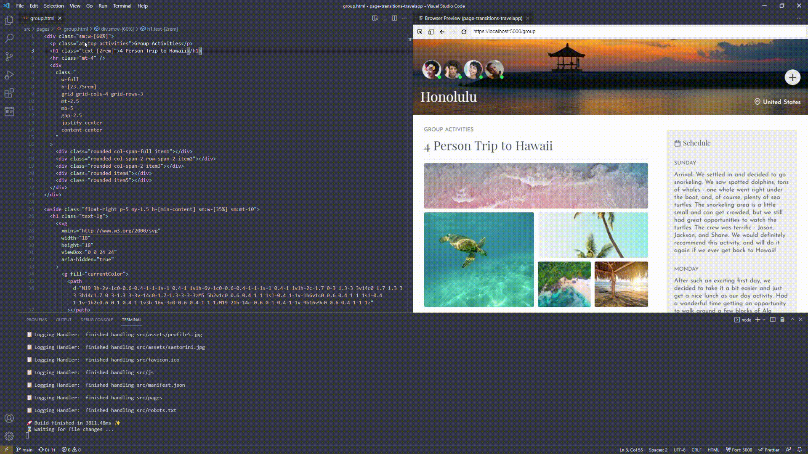

# html-bundle

<p align="center">
  
</p>

A (primarily) zero-config bundler for HTML files. The idea is to use HTML as Single File Components, because HTML can already include `<style>` and `<script>` elements.

## Features

- 🦾 TypeScript (reference it as .js or write inline TS)
- 📦 Automatic Package Installation
- 💨 HMR and automatic reconnect
- ⚡ [ESBuild](https://github.com/evanw/esbuild)
- 🦔 [Critical CSS](https://github.com/evanw/esbuild)
- 🚋 Watcher on PostCSS and Tailwind CSS and TS Config
- 🛡️ Almost no need to restart

## Demo



## Installation and Usage

```properties
$ npm install -D html-bundle
```

Add an entry to script in package.json (see flags below).

```json
{
  "scripts": {
    "build": "html-bundle"
  }
}
```

Add a `postcss.config.js` file and run the build command.
<em>If you do not create this config file, a minimal in-memory config file will be created with `cssnano` as plugin.</em>

```properties
$ npm run build
```

## CLI

`--hmr`: boots up a static server and enables Hot Module Replacement. **This generates a development build and works best when not triggered from the main index.html**<br>
`--secure`: creates a secure HTTP2 over HTTPS instance. This requires the files `localhost.pem` and `localhost-key.pem` in the root folder. You can generate them with [mkcert](https://github.com/FiloSottile/mkcert) for instance.<br>
`--critical`: uses critical to extract and inline critical-path CSS to HTML.<br>
`--handler`: path to your custom handler. Here, you can handle all non-supported files. You can get the filename via `process.argv[2]`.

## Optional Config

_The CLI flags can also be set by the config. Flags set by the CLI will override the config._
Generate the config in the root and call it "bundle.config.js"

**src:** input path. Default to "src"<br>
**build:** output path. Defaults to "build"<br>
**port:** For the HMR Server. Defaults to 5000<br>
**deletePrev:** Whether to delelte the build folder. Defaults to true<br>
**esbuild:** Your additional config<br>
**html-minifier-terser:** Your additional config<br>
**critical:** Your additional config<br>

## Concept

The bundler always globs all HTML, CSS and TS/JS files from the `src` (config) directory and processes them to the `build` (config) directory. PostCSS is being used for CSS files and inline styles, html-minifier-terser for HTML and esbuild to bundle, minify, etc. for inline and referenced TS/JS. Server-sent events and [hydro-js](https://github.com/Krutsch/hydro-js) are used for HMR. In order to trigger SPA Routers, the popstate event is being triggered after HMR Operations.

## Example hydro-js

Get the idea from [hydro-starter](https://github.com/Krutsch/hydro-starter).<br>
Set `"jsxFactory": "h"` in `tsconfig.json` for JSX.

### Input

```html
<!DOCTYPE html>
<html lang="en">
  <head>
    <meta charset="UTF-8" />
    <meta name="viewport" content="width=device-width, initial-scale=1.0" />
    <title>Example</title>
    <meta name="Description" content="Example for html-bundle" />
    <script type="module">
      import { render, h, reactive } from "hydro-js";

      function Example({ name }) {
        return <main id="app">Hi {name}</main>;
      }

      const name = reactive("Tester");
      render(<Example name={name} />, "#app");
    </script>
    <style>
      body {
        background-color: whitesmoke;
      }
    </style>
  </head>
  <body>
    <main id="app"></main>
  </body>
</html>
```

## Example Vue.js@next

Set `"jsxFactory": "h"` in `tsconfig.json`.

```html
<!DOCTYPE html>
<html lang="en">
  <head>
    <meta charset="UTF-8" />
    <meta name="viewport" content="width=device-width, initial-scale=1.0" />
    <title>Vue Example</title>
  </head>
  <script type="module">
    import { createApp, h } from "vue";

    const App = {
      data() {
        return {
          name: "Fabian",
        };
      },
      render() {
        return <p>{this.name}</p>;
      },
    };

    createApp(App).mount("#app");
  </script>
  <body>
    <div id="app"></div>
  </body>
</html>
```

## Example React

Set `"jsxFactory": "h"` in `tsconfig.json`.

```html
<!DOCTYPE html>
<html lang="en">
  <head>
    <meta charset="UTF-8" />
    <meta name="viewport" content="width=device-width, initial-scale=1.0" />
    <title>React Example</title>
  </head>
  <script type="module">
    import React, { useState } from "react";
    import { render } from "react-dom";
    const h = React.createElement;

    function Example() {
      const [count, setCount] = useState(0);

      return (
        <div>
          <p>You clicked {count} times</p>
          <button onClick={() => setCount(count + 1)}>Click me</button>
        </div>
      );
    }

    render(<Example />, document.getElementById("app"));
  </script>
  <body>
    <div id="app"></div>
  </body>
</html>
```
